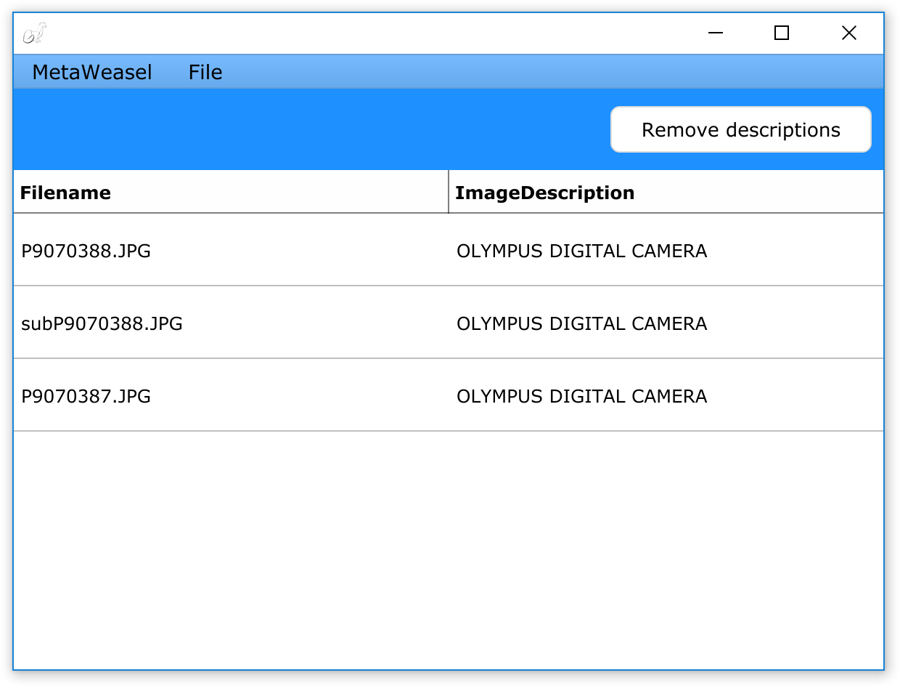
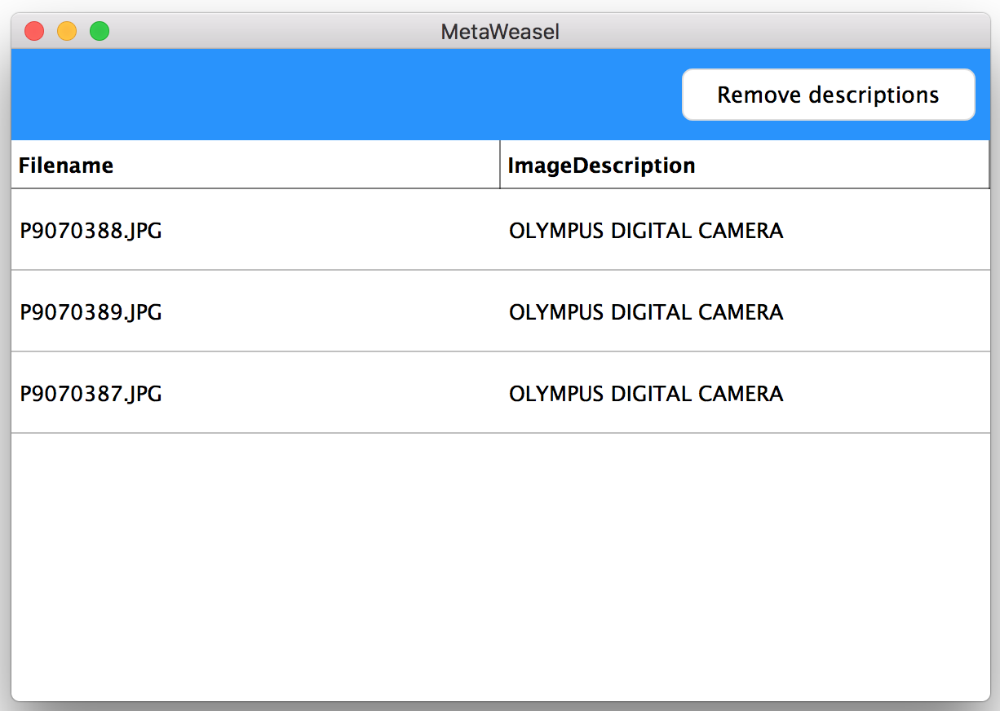

*Last updated April 9th, 2019*


# MetaWeasel


(From https://www.heynow.com/metaweasel)

MetaWeasel lets you view [exif metadata](https://www.slrphotographyguide.com/what-is-exif-metadata/) on images and remove Exif.Image.ImageDescription tags from them. This is a common task that my underwater photography friend has to deal with manually, so I made him a utility for it. MetaWeasel is based on the excellent [Exiv cross-platform library](http://www.exiv2.org/index.html) and builds on macOS and Windows using the [JUCE application framework](http://www.juce.com).

**Windows Screenshot**



**macOS Screenshot**



## How To Build

There are a couple of build dependencies you have to setup before you can build for your OS.

### macOS build prerequisites

For macOS builds, you'll need XCode 9.4.1 or later installed.

Download the [.zip of JUCE v5.4.2](https://github.com/WeAreROLI/JUCE/releases/tag/5.4.2). Unpack the zip and place it at `~/JUCE`

We use [homebrew](http://brew.sh) to install our external software and tool dependencies. Install brew using this command:
````
ruby -e "$(curl -fsSL https://raw.githubusercontent.com/Homebrew/install/master/install)"
````
Then install MetaWeasel's C++ dependencies with this command:
````
brew install exiv2
````

### Windows build prerequisites

To date we've been doing builds on Windows 10 with Visual Studio 2017 installed. You'll need to ensure that the "Desktop development with C++" and the latest "Windows 10 SDK for Desktop C++" features are installed and also select the "Windows 10 SDK (10.0.16299.0) for Desktop C++ [x86 and x64]

Use the "Developer Command Prompt for VS2017" any time this README calls for using a Windows command prompt. It properly sets up the paths to the "msbuild" command.

Download the [.zip of JUCE v5.4.2](https://github.com/WeAreROLI/JUCE/releases/tag/5.4.2). Unpack the zip and place it at `C:\tools\JUCE`

Then from a command prompt, do the following:
````
cd \tools
git clone https://github.com/Microsoft/vcpkg vcpkg
cd vcpkg
.\bootstrap-vcpkg.bat
````

Then install MetaWeasel's C++ dependencies with this command:
````
vcpkg install --triplet x86-windows exiv2
````

## Doing the build

You can hand-build MetaWeasel by opening `{clone-root}/common/MetaWeasel/MetalWeasel.jucer` in Projucer and then generating the Xcode or Visual Studio 2017 IDE project, and building that. That is the normal path for doing development work on the project, using the Debug configuration. 
